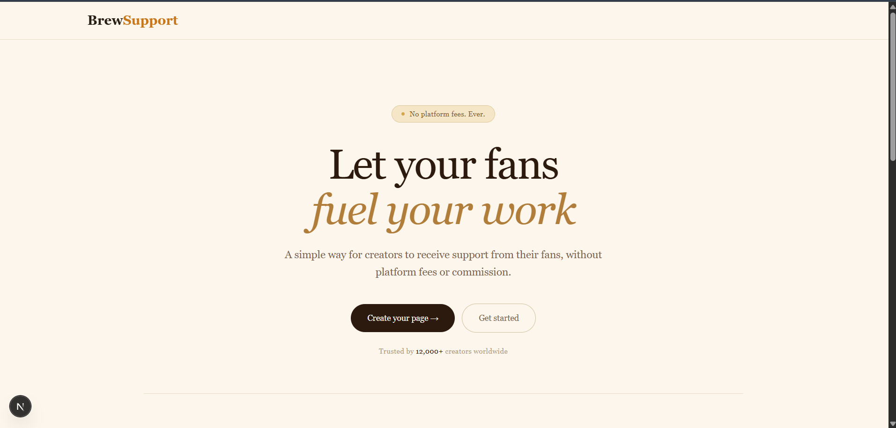
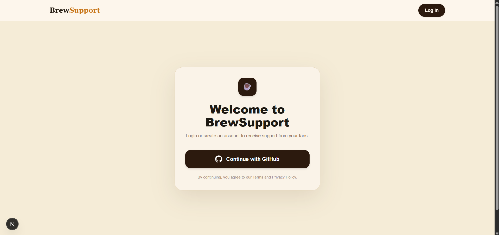
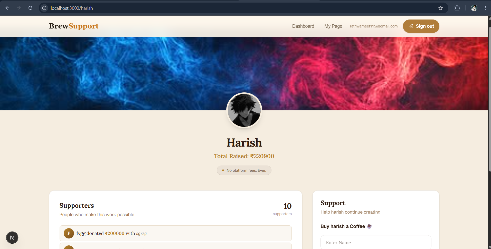

# BrewSupport ☕

> A full-stack creator support platform — support your favorite creators with a coffee, powered by real payments.


## 🌐 Live Demo

> [Add your Vercel deployment link here]

---

## 📌 About

BrewSupport is a BuyMeCoffee-inspired platform where fans can support creators through one-time payments. Built with Next.js 14 using the App Router, it features GitHub OAuth login, Razorpay payment integration, creator dashboards, and secure session management.

---

## ✨ Features

- 🔐 **GitHub OAuth** — One-click login via NextAuth.js
- 💳 **Razorpay Payments** — Real payment gateway integration for creator support
- 👤 **Creator Profiles** — Public pages at `/{username}` for each creator
- 📊 **Dashboard** — Creators can view their support history and manage their profile
- 🔒 **Secure Sessions** — Server-side session handling with SessionWrapper
- 🗄️ **MongoDB** — Persistent storage for users and payment records
- 🎨 **Responsive UI** — Built with Tailwind CSS

---

## 🛠️ Tech Stack

| Layer | Technology |
|---|---|
| Framework | Next.js 14 (App Router) |
| Auth | NextAuth.js (GitHub Provider) |
| Payments | Razorpay |
| Database | MongoDB + Mongoose |
| Styling | Tailwind CSS |
| Deployment | Vercel |

---

## 📁 Project Structure

```
brewsupport/
├── app/
│   ├── [username]/         # Public creator profile pages
│   ├── api/
│   │   ├── auth/           # NextAuth route handler
│   │   └── razorpay/       # Payment API route
│   ├── dashboard/          # Creator dashboard
│   ├── login/              # Login page
│   └── layout.js           # Root layout with SessionWrapper
├── actions/
│   └── useraction.js       # Next.js server actions
├── components/
│   ├── Navbar.js
│   ├── Footer.js
│   ├── PaymentPage.js
│   └── SessionWrapper.js
├── db/
│   └── connectDB.js        # MongoDB connection
├── models/
│   ├── user.js             # User schema
│   └── payment.js          # Payment schema
└── .env.local              # Environment variables (not committed)
```

---

## 🚀 Getting Started

### Prerequisites

- Node.js 18+
- MongoDB Atlas account (or local MongoDB)
- Razorpay account (for API keys)
- GitHub OAuth App (for auth)

### Installation

```bash
# Clone the repository
git clone https://github.com/Harish115-dev/brew-support.git
cd brewsupport

# Install dependencies
npm install

# Set up environment variables
cp .env.example .env.local
# Fill in your keys (see below)

# Run the development server
npm run dev
```

Open [http://localhost:3000](http://localhost:3000) in your browser.

### Environment Variables

Create a `.env.local` file with the following:

```env
# MongoDB
MONGODB_URI=your_mongodb_connection_string

# NextAuth
NEXTAUTH_URL=http://localhost:3000
NEXTAUTH_SECRET=your_nextauth_secret

# GitHub OAuth
GITHUB_ID=your_github_client_id
GITHUB_SECRET=your_github_client_secret

# Razorpay
RAZORPAY_KEY_ID=your_razorpay_key_id
RAZORPAY_KEY_SECRET=your_razorpay_key_secret
```

> ⚠️ Never commit `.env.local` to GitHub. It is already added to `.gitignore`.

---

## 💡 Key Implementation Details

- **Razorpay Integration** — Server-side order creation via API route, client-side checkout trigger on PaymentPage component
- **Dynamic Creator Pages** — `app/[username]/page.js` fetches creator data from MongoDB and renders a public support page
- **Server Actions** — `useraction.js` handles database mutations without a separate API route
- **Session Management** — `SessionWrapper` wraps the app with NextAuth's `SessionProvider` for client-side session access

---

## 📸 Screenshots




---

## 🙋 Author

**Harishchandra Rathwa**  
BCA Student @ Vidhyadeep University  
[LinkedIn](https://www.linkedin.com/in/harishchandra-rathwa) • [GitHub](https://github.com/Harish115-dev/brew-support.git)

---

## 📄 License

feel free to use this as a reference for learning.